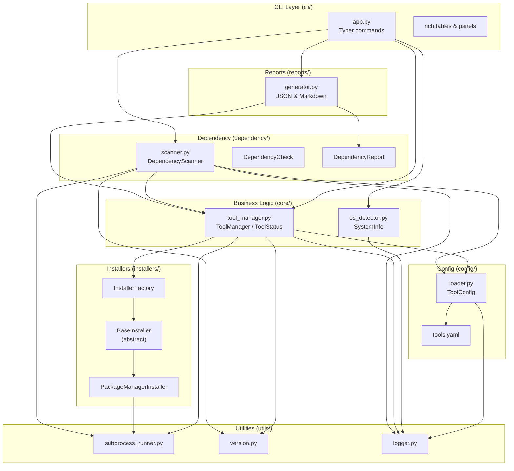
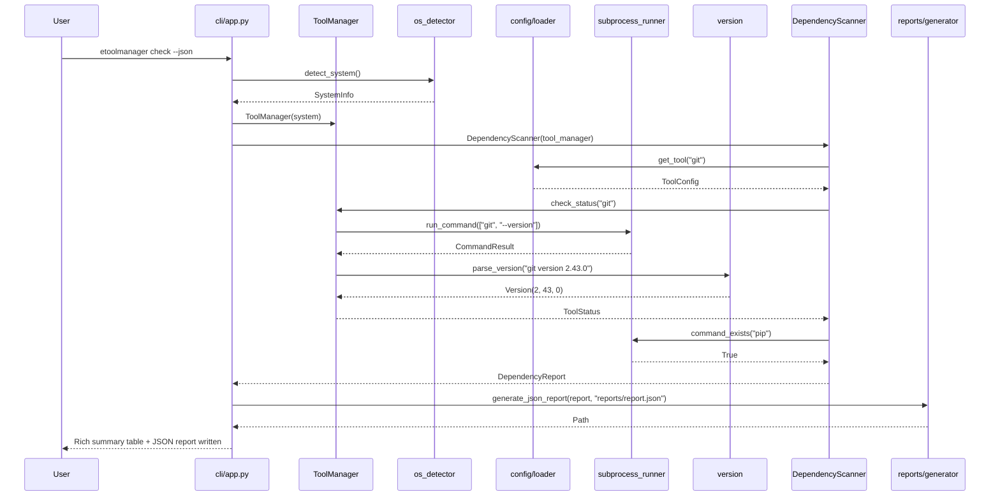

# eToolManager - Architecture Documentation

> **Automated Tool Manager for the eSim Ecosystem**

---

## Table of Contents

- [1. Overview](#1-overview)
- [2. Component Diagram](#2-component-diagram)
- [3. Module Interactions](#3-module-interactions)
- [4. Data Flow](#4-data-flow)
- [5. Class Responsibilities](#5-class-responsibilities)
- [6. Design Decisions](#6-design-decisions)
- [7. SOLID Principles Applied](#7-solid-principles-applied)
- [8. Author & Attribution](#8-author--attribution)

---

## 1. Overview

eToolManager is a cross-platform Python application that automates the
installation, detection, configuration, version management, dependency
checking, and status reporting of external tools required by **eSim**.

The architecture follows a **layered** design:

```
┌─────────────────────────────────────────────────────────────┐
│                    Presentation Layer (CLI)                 │
│            typer commands + rich rendering                   │
├─────────────────────────────────────────────────────────────┤
│                    Business Logic Layer                      │
│          ToolManager, DependencyScanner, OSDetector          │
├─────────────────────────────────────────────────────────────┤
│                    Strategy Layer                            │
│          BaseInstaller / PackageManagerInstaller             │
├─────────────────────────────────────────────────────────────┤
│                    Configuration Layer                       │
│            tools.yaml registry + ToolConfig                  │
├─────────────────────────────────────────────────────────────┤
│                    Utility Layer                             │
│        subprocess_runner, version, logger                    │
└─────────────────────────────────────────────────────────────┘
```

Each layer only depends on the layer(s) directly below it, keeping the
system testable and maintainable.

---

## 2. Component Diagram



---

## 3. Module Interactions

| Module | Responsibility | Depends On | Used By |
|--------|----------------|------------|---------|
| `cli/app.py` | CLI commands, Rich UI | `core`, `dependency`, `reports` | end user |
| `core/os_detector.py` | OS & package manager detection | `utils/logger` | `cli`, `core/tool_manager`, `dependency` |
| `core/tool_manager.py` | Tool lifecycle facade | `config`, `utils`, `installers` | `cli`, `dependency` |
| `installers/base.py` | Abstract installer interface | `config`, `utils` | factory |
| `installers/package_manager.py` | Concrete package-manager strategy | `config`, `utils` | factory |
| `installers/factory.py` | Selects installer strategy | `installers/base`, `installers/package_manager` | `core/tool_manager` |
| `dependency/scanner.py` | Environment checks & aggregation | `core`, `config`, `utils` | `cli`, `reports` |
| `reports/generator.py` | JSON/Markdown serialisation | `dependency`, `core` | `cli` |
| `config/loader.py` | YAML registry loading/validation | `utils/logger`, PyYAML | `core`, `dependency`, `installers` |
| `utils/subprocess_runner.py` | Safe subprocess wrapper | stdlib | `core`, `dependency`, `installers` |
| `utils/version.py` | Version parsing/comparison | stdlib | `core`, `dependency` |
| `utils/logger.py` | Structured logging config | stdlib | all modules |

---

## 4. Data Flow



---

## 5. Class Responsibilities

| Class | Module | Responsibility |
|-------|--------|----------------|
| `SystemInfo` | `core/os_detector.py` | Immutable OS snapshot (name, display, version, arch, pkg manager, Python version). Exposes `to_dict()` for reports. |
| `ToolConfig` | `config/loader.py` | Immutable tool registry entry: display name, description, version command, binary names, install/uninstall commands per OS. |
| `ToolStatus` | `core/tool_manager.py` | Per-tool detection result: installed flag, parsed version, minimum version, meets-minimum comparison. |
| `ToolManager` | `core/tool_manager.py` | Facade for tool lifecycle: `check_status`, `check_all`, `install`, `uninstall`. Resolves platform-specific commands. |
| `BaseInstaller` | `installers/base.py` | Abstract Strategy interface: `install()` and `uninstall()`. |
| `PackageManagerInstaller` | `installers/package_manager.py` | Concrete strategy that runs package-manager commands, prepending `sudo` on POSIX. |
| `InstallerFactory` | `installers/factory.py` | Factory Method that returns the correct installer for the detected OS key. |
| `DependencyCheck` | `dependency/scanner.py` | Single dependency result: category, name, ok flag, detail, suggested fix. |
| `DependencyReport` | `dependency/scanner.py` | Aggregated report: system info, all checks, missing list, unique fixes, readiness flag, summary counts. |
| `DependencyScanner` | `dependency/scanner.py` | Runs all individual checks, aggregates missing/fixes, computes readiness. |
| `CommandResult` | `utils/subprocess_runner.py` | Standardised subprocess result: returncode, stdout, stderr, command list. |
| `Version` | `utils/version.py` | Immutable semantic version with comparison operators. |

---

## 6. Design Decisions

### 6.1 Declarative YAML Tool Registry

Tools are defined in `config/tools.yaml` rather than in Python code.
Adding a new tool requires editing a data file, not modifying the
program logic. This makes the system maintainable and user-extensible.

### 6.2 Facade Pattern for Tool Management

`ToolManager` is a facade that hides the complexity of OS detection,
command resolution, subprocess execution, and version parsing from the
CLI. The CLI only sees `check_status()`, `install()`, `uninstall()`,
and `check_all()`.

### 6.3 Strategy Pattern for Installers

The `BaseInstaller` interface plus `PackageManagerInstaller` and
`InstallerFactory` implement the Strategy pattern. New platforms or
custom install methods (e.g. AppImage, tarball download) can be added
without changing the callers.

### 6.4 Separation of Business Logic from CLI

All business logic lives in `core/`, `dependency/`, `config/`, and
`installers/`. The CLI module (`cli/app.py`) only parses commands,
invokes logic, and renders results with Rich. The same logic could be
reused by a GUI or API server.

### 6.5 Immutable Data Classes

`SystemInfo`, `ToolConfig`, `ToolStatus`, `DependencyCheck`, and
`DependencyReport` are dataclasses. Immutability (where appropriate)
prevents accidental state mutation and makes testing predictable.

### 6.6 Safe Subprocess Wrapper

All subprocess calls go through `run_command()` which:
- Always captures stdout/stderr as text
- Enforces a timeout to prevent hangs
- Returns a structured `CommandResult`
- Raises a clear `RuntimeError` when `check=True` and the command fails

### 6.7 Structured Logging

The `logger.py` module configures a single root logger with console and
rotating-file handlers. Every module uses `get_logger(__name__)`, so logs
show the originating module for easy debugging.

---

## 7. SOLID Principles Applied

| Principle | Application |
|-----------|-------------|
| **S** - Single Responsibility | Each class has one reason to change. `ToolManager` manages lifecycle; `DependencyScanner` runs checks; `report.generator` serialises output. |
| **O** - Open/Closed | Add a new tool by adding a YAML block. Add a new installer by implementing `BaseInstaller`. No existing code changes needed. |
| **L** - Liskov Substitution | `PackageManagerInstaller` is fully substitutable for `BaseInstaller`. The factory returns the abstract type to all callers. |
| **I** - Interface Segregation | `BaseInstaller` exposes only `install()` and `uninstall()`. `DependencyCheck` exposes only what a check needs. |
| **D** - Dependency Inversion | High-level modules (`ToolManager`, `DependencyScanner`, CLI) depend on abstractions (`BaseInstaller`, `ToolConfig`, `CommandResult`) rather than on concrete subprocess calls or platform-specific code. |

---

## 8. Author & Attribution

This architecture was designed and implemented by **Tejas Kamble** as a
submission prototype for the **FOSSEE eSim Semester Long Internship –
Autumn 2026 (Task 5: Automated Tool Manager)**.

| Field | Value |
|-------|-------|
| **Author** | Tejas Kamble |
| **Email** | [tejasksocials@gmail.com](mailto:tejasksocials@gmail.com) |
| **Phone** | +91 8928545352 |
| **Portfolio** | https://tejas-personal-portfolio-dev.vercel.app/ |
| **LinkedIn** | https://www.linkedin.com/in/tejas-kamble-5342443b1 |
| **GitHub** | https://github.com/tejasworkspacews1-ui |
| **Instagram** | @tejask.co.in |

### Attribution Statement

The original code, architecture, documentation, and implementation in this
repository are the work of **Tejas Kamble**. This project is **not** a
claim of ownership over:

- The **FOSSEE Project** or the **eSim** application
- **KiCad**, **Ngspice**, or any other third-party software
- Any external open-source projects or dependencies referenced

All third-party software and dependencies remain the property of their
respective owners and are used under their respective licenses.

---

© 2026 Tejas Kamble · Built for the FOSSEE eSim Semester Long Internship –
Autumn 2026 · [GitHub](https://github.com/tejasworkspacews1-ui)